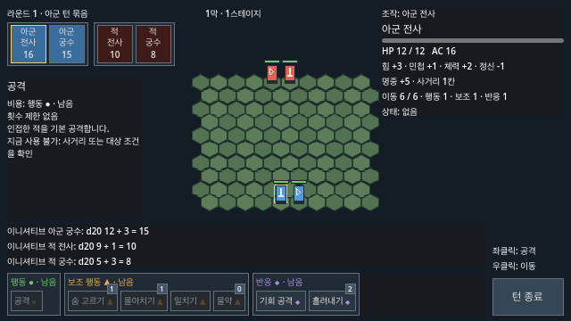
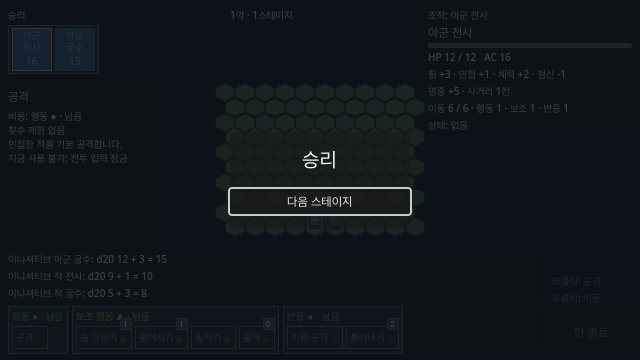
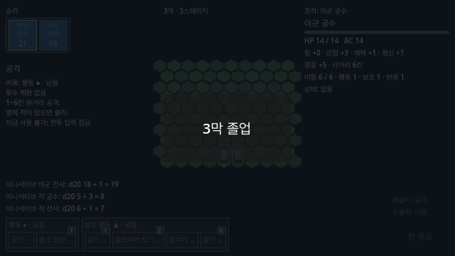

# Issue #54 막 진행과 자원 검증

기준은 [Issue #54](https://github.com/minjunkim-dev/BGLike/issues/54)와 [게임 구조 기획서 2~3장](GAME_STRUCTURE.md#2-진행-구조)이다.
1-1 → 1-2 → 1-3 → 2-1 → … → 3-3 순서로 전투한다.
현재 시험 맵과 적 전사·궁수 배치를 9번 사용한다.

## 자원과 전환

| 항목 | 같은 막의 다음 전투 | 다음 막 시작·전멸 재시작 |
|---|---|---|
| HP | 유지 | 최대 HP |
| 전투 불능 | 유지. 턴 순서와 필드에서 제외 | 부활 |
| 스킬 횟수 | 유지 | 숨 고르기1·흘려내기2·몰아치기1·표식1·충격 화살1·물러서며 쏘기2 |
| 물약 | 현재 개수 유지 | 현재 개수 유지 |
| 표식·기절·이번 턴 효과 | 해제 | 해제 |

시작 물약은0개다.
물약 획득·장비·보상·정비는 Issue #55에서 구현한다.
지금은 승리 결과 버튼을 스테이지 사이 진입점으로 사용한다.
게임을 종료하면 진행을 저장하지 않는다.

## 스테이지 데이터

- `scenes/combat/battle.tscn`의 `stages` 배열은 순서대로9개 `CombatStage` 데이터를 사용한다.
- 현재9칸에는 같은 `stage.tres`를 넣는다.
- `CombatStage`는 맵 크기·타일·아군 시작 칸·적 배치 장면을 가진다.
- `enemies.tscn`은 지금 사용하는 적 배치다. 각 자식은 `CombatUnit`이다.
- 맵과 적 배치를 바꿀 때 해당 스테이지 데이터를 별도로 만든다. M5 콘텐츠를 미리 추가하지 않는다.

## 자동 검증

`GODOT=/Applications/Godot.app/Contents/MacOS/Godot make check`는 기존 전투 회귀 검사와 `tests/combat_progression_test.gd`를 실행한다.
2026-10-08 로컬에서 Python51개와 Godot3892개 검사를 통과했다.
Godot 확인 수는 turns2366·checks61·actions267·HUD1085·AI67·progression46이다.
진행 검사는 실제 메인 장면과 결과 버튼의 포인터 입력에서 순서와 자원 변화를 확인한다.
일부 초기 HP와 스킬 횟수는 테스트 상태로 설정한다.
이 검사는 플레이어가 전투9번을 직접 수행한 기록이 아니다.

검사 범위는 현재 막·스테이지 표시, 두 직업의 HP·스킬 횟수 유지, 전투 불능 제외, 막 시작·전멸 회복, 물약 유지, 효과 해제, 맵 데이터 적용, 입력 잠금과3막 졸업이다.
실제 적 턴 타이머를 실행한 상태에서 승리 조건을 테스트 값으로 설정한다.
이때 전환을 거부하고 적 턴 처리 완료 뒤 전환을 허용하는지 확인한다.
이 검사는 적의 실제 공격으로 전투가 끝나는 모든 타이밍을 재현하지 않는다.

## 실제 렌더링 화면

Godot4.7.2의 실제 장면을640×360에서 렌더링했다.
캡처에서는 턴 순서를 고정하고 결과 상태를 테스트 값으로 설정했다.
이 화면은 직접 전투9번을 수행한 기록이 아니다.

진행 표시:

스테이지 사이 진입점:

3막 졸업:

## 사람이 확인할 항목

1. 메인 장면을 실행한다. `1막 · 1스테이지` 표시와 물약0개 안내를 확인한다.
2. HP와 스킬을 사용하고 승리한다. 결과 버튼으로 다음 전투에 진입한다. 같은 막의 HP와 횟수 유지와 표식 해제를 확인한다.
3. 아군 한 명이 전투 불능인 상태로 승리한다. 다음 전투에서 그 아군이 나타나지 않는지 확인한다.
4. 막 마지막 전투를 승리하거나 전멸한다. 다음 막 시작 또는 현재 막 첫 전투에서 HP·부활·스킬 회복을 확인한다.
5. 3-3을 승리한다. `3막 졸업`과 다음 전투 버튼이 없는지 확인한다.

자동 입력과 화면 캡처를 사람이 수행한 직접 조작으로 기록하지 않는다.
