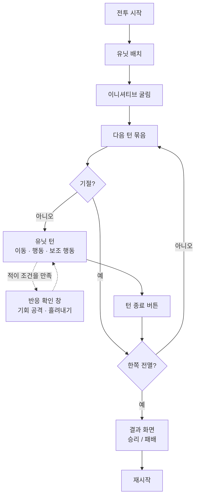

# 전투 시스템 기획서

> 이번 스프린트(~2026-10-11)에 구현할 전투 규칙입니다. 개발은 이 문서를 기준으로 합니다.
>
> - 기준일: 2026-10-02
> - 범위 결정 배경: [기획 현황](DESIGN_STATUS.md)
> - 규칙 근거: SRD 5e (CC-BY-4.0). BG3 고유 명칭, 아이콘, 텍스트는 쓰지 않습니다.
> - 용어: `feat/combat-prototype` 브랜치의 `CONTEXT.md`를 따르고, 새 용어는 [8장](#8-새-용어)에 정리했습니다.
> - 표시: ❓ 기획 확인 필요

---

## 목차

1. [프로토타입 대비 바뀌는 점](#1-프로토타입-대비-바뀌는-점)
2. [시험 전투](#2-시험-전투)
3. [턴 진행](#3-턴-진행)
4. [판정](#4-판정)
5. [동작](#5-동작)
6. [상태 이상](#6-상태-이상)
7. [적 AI](#7-적-ai)
8. [새 용어](#8-새-용어)
9. [화면과 조작](#9-화면과-조작)
10. [기획 확인 필요](#10-기획-확인-필요)

---

## 1. 프로토타입 대비 바뀌는 점

개발 담당이 먼저 볼 요약입니다.

| 영역 | 프로토타입 | 이번 스프린트 |
|---|---|---|
| 능력치 | 힘, 민첩, 건강 | **+ 정신** |
| 턴 자원 | 이동 + 행동 | 이동 + 행동 + **보조 행동** + **반응** |
| 턴 순서 | 한 명씩 | 같은 편이 연속이면 **턴 묶음** |
| 기본 공격 | 공격 하나 | **기회 공격 가능/불가** 타입 추가 |
| 원거리 공격 | 사거리 1~12칸 | **사거리 1~6칸**. **공격자 옆에 적이 있으면 불리** |
| 판정 | 명중 판정 | + **유리/불리**, **내성 굴림** |
| 능력 | 없음 | 유닛당 **스킬 3개** (전투당 횟수 제한) |
| 공용 동작 | 없음 | **밀치기**, **물약** |
| 상태 이상 | 없음 | **기절** |
| 적 AI | 접근 후 공격 | + 스킬 사용, 궁수 거리 벌리기, 반응 자동 사용 |

---

## 2. 시험 전투

| 항목 | 값 |
|---|---|
| 맵 | 10×10 아이소메트릭 격자, 높이 없음, 장애물 없음 |
| 편성 | 아군: 전사 1, 궁수 1 / 적: 전사 1, 궁수 1 |
| 배치 | 맵 반대편 가장자리에 고정 (프로토타입과 같음) |
| 승패 | 한쪽이 모두 전투 불능이 되면 끝 |

### 유닛

| 유닛 | 힘 | 민첩 | 건강 | 정신 | HP | AC | 이동력 |
|---|---|---|---|---|---|---|---|
| 전사 | +3 | +1 | +2 | −1 | 12 | 16 | 6 |
| 궁수 | +0 | +3 | +1 | +1 | 11 | 14 | 6 |

| 유닛 | 기본 공격 | 공격 능력치 | 공격 보너스 | 피해 | 사거리 | 기회 공격 | 내성 DC |
|---|---|---|---|---|---|---|---|
| 전사 | 근접 | 힘 | +5 | 1d8+3 | 1 (인접) | 가능 | 10 |
| 궁수 | 원거리 | 민첩 | +5 | 1d6+3 | 1~6 | 불가 | 10 |

- 숙련 보너스는 +2로 고정입니다.
- 궁수 사거리는 6칸입니다. 10×10 맵의 가장 먼 거리가 9칸이라, 12칸이면 맵 어디든 닿아 위치 선정이 의미가 없어서 줄였습니다.
- **내성 DC** = `8 + 숙련 보너스 + 공격 능력치 보정값`. 이 유닛이 거는 효과를 상대가 버티는 기준입니다.

---

## 3. 턴 진행

### 3-0. 전투 진행 흐름

### 3-1. 이니셔티브

프로토타입과 같습니다. 전투 시작 때 `d20 + 민첩`으로 정하고, 동점이면 민첩이 높은 쪽, 그다음 아군이 먼저입니다.

### 3-2. 턴 묶음

이니셔티브 순서에서 **같은 편 유닛이 연달아 있으면 한 묶음**으로 진행합니다.

- 묶음 안에서는 플레이어가 어느 유닛을 먼저 움직일지 고르고, 언제든 다른 유닛으로 바꿔 조작할 수 있습니다.
- 자원(이동력, 행동, 보조 행동)은 유닛마다 따로입니다.
- 묶음의 모든 유닛이 턴을 마치면 다음 순서로 넘어갑니다.
- 전투 불능이 된 유닛은 묶음에서 빠집니다.
- 적 묶음은 AI가 이니셔티브 순서대로 진행합니다.

> 예: 이니셔티브가 `아군 전사 → 아군 궁수 → 적 전사 → 적 궁수`면 아군 둘이 한 묶음, 적 둘이 한 묶음입니다.

### 3-3. 턴 자원

| 자원 | 횟수 | 회복 시점 | 쓰는 곳 |
|---|---|---|---|
| 이동력 | 6칸 | 자기 턴 시작 | 이동. 나눠 쓸 수 있음 |
| 행동 | 1회 | 자기 턴 시작 | 기본 공격, 행동형 스킬 |
| 보조 행동 | 1회 | 자기 턴 시작 | 밀치기, 물약, 보조 행동형 스킬 |
| 반응 | 1회 | 자기 턴 시작 | 기회 공격, 반응형 스킬 (다른 유닛의 턴에 사용) |

- 반응은 기회 공격과 흘려내기가 **함께 씁니다.** 한 라운드에 둘 중 하나만 쓸 수 있습니다.

### 3-4. 턴 종료

- 턴은 항상 **턴 종료 버튼**으로 끝냅니다. 자동 종료는 없습니다.
- 더 할 수 있는 동작이 없으면 턴 종료 버튼을 **강조**합니다. (9-1)
- "할 수 있는 동작"은 남은 이동력으로 갈 칸이 있거나, 남은 행동·보조 행동으로 쓸 수 있는 동작에 대상이 있는 경우입니다. 반응은 따지지 않습니다.

---

## 4. 판정

### 4-1. 명중 판정

프로토타입과 같습니다.

- `d20 + 공격 보너스 ≥ 대상 AC`면 명중
- d20이 20이면 치명타: 피해 주사위를 두 번 굴림
- d20이 1이면 자동 실패

### 4-2. 유리 / 불리

- **유리**: d20을 두 번 굴려 높은 값을 씁니다.
- **불리**: d20을 두 번 굴려 낮은 값을 씁니다.
- 유리와 불리가 함께 있으면 서로 지워져 한 번만 굴립니다.
- 같은 쪽이 여러 개 있어도 겹치지 않습니다. (유리 2개도 두 번만 굴림)
- 치명타와 자동 실패는 **선택된 d20**으로 판단합니다.
- 명중률 표시에도 유리/불리를 반영합니다.

| 발생 조건 | 결과 |
|---|---|
| 기절한 대상을 공격 | 공격자 유리 |
| 원거리 공격을 할 때 공격자의 인접 칸에 기절하지 않은 적이 있음 | 공격자 불리 |

### 4-3. 내성 굴림

- `d20 + 대상의 해당 능력치 보정값 ≥ 효과를 건 유닛의 내성 DC`면 버팁니다.
- 1과 20의 자동 성공/실패는 없습니다. (SRD 5e 규칙)

### 4-4. 대결

밀치기에 씁니다. 양쪽이 각자 d20을 굴려 높은 쪽이 이깁니다. **동점이면 대상(방어하는 쪽)이 이깁니다.**

---

## 5. 동작

### 5-1. 기본 공격

| 항목 | 내용 |
|---|---|
| 소비 | 행동 |
| 횟수 | 제한 없음 (행동이 있는 한) |
| 판정 | 명중 판정 |
| 사거리 | 유닛 표 참고. 원거리도 인접 칸을 공격할 수 있지만, 4-2의 불리 조건을 받음 |

### 5-2. 기회 공격

| 항목 | 내용 |
|---|---|
| 소비 | 반응 |
| 조건 | 기회 공격 **가능** 타입의 기본 공격을 가진 유닛만 |
| 발동 | 적이 **스스로 이동해서** 내 인접 칸(8칸)을 벗어나려 할 때 |
| 효과 | 기본 공격 1회. 벗어나기 직전 칸에서 판정하고, 대상이 버티면 이동을 계속함 |
| 발동 안 함 | 밀치기로 밀려난 경우, 물러서며 쏘기를 쓴 경우 |
| 조작 | 아군은 매번 사용 여부를 묻습니다 (9장). 적은 자동으로 씁니다 |

### 5-3. 스킬

모든 스킬 횟수는 **전투당**입니다. 전투가 끝날 때까지 회복되지 않습니다.

#### 전사

| 스킬 | 소비 | 횟수 | 대상 | 효과 |
|---|---|---|---|---|
| **숨 고르기** | 보조 행동 | 1 | 자신 | HP `1d10+1` 회복. 최대 HP를 넘지 않음 |
| **흘려내기** | 반응 | 2 | 자신 | 공격에 **명중당했을 때**, 피해를 굴리기 전에 사용. `d20 + 민첩 ≥ 공격자의 내성 DC`면 그 공격을 피함 (치명타 포함) |
| **몰아치기** | 없음 | 1 | 자신 | 이번 턴에 행동 1회 추가 |

- 흘려내기 성공 확률: 공격자 내성 DC 10 기준 60%
- 흘려내기로 피한 공격의 추가 효과(충격 화살의 기절 등)도 일어나지 않습니다.

#### 궁수

| 스킬 | 소비 | 횟수 | 대상 | 효과 |
|---|---|---|---|---|
| **표식** | 보조 행동 | 1 | 적 1명, 사거리 1~6 | 전투가 끝날 때까지, 궁수가 이 대상을 맞히면 피해 `+1d6`. 치명타면 이 1d6도 두 번 굴림 |
| **충격 화살** | 행동 | 1 | 적 1명, 사거리 1~6 | 기본 공격과 같은 원거리 명중 판정(불리 조건 포함). 명중하면 피해를 준 뒤, 대상이 **정신 내성**(DC 10)에 실패하면 **기절** |
| **물러서며 쏘기** | 보조 행동 | 2 | 자신 | 이번 턴의 남은 이동은 기회 공격을 받지 않음 |

- 충격 화살은 행동을 쓰는 기본 공격의 대체입니다. 빗나가면 횟수만 소모됩니다.
- 표식은 한 번 걸면 대상을 바꿀 수 없고, 대상이 전투 불능이 되면 사라집니다.

### 5-4. 공용 동작

스킬이 아니며, 모든 유닛이 씁니다.

| 동작 | 소비 | 횟수 | 대상 | 효과 |
|---|---|---|---|---|
| **밀치기** | 보조 행동 | 제한 없음 | 인접한 적 1명 | `d20 + 힘` 대 대상의 `d20 + max(힘, 민첩)` 대결. 이기면 대상을 **1칸 밀어냄** |
| **물약** | 보조 행동 | 유닛당 1개 | 자신 | HP `2d4+2` 회복. 최대 HP를 넘지 않음 |

밀치기 세부 규칙:

- 밀리는 방향은 **밀치는 유닛 → 대상** 방향(8방향)입니다.
- 밀려날 칸이 맵 밖이거나 다른 유닛이 있으면 밀치기를 **선택할 수 없습니다.** (미리보기 단계에서 막음)
- 밀려나는 이동은 기회 공격을 일으키지 않습니다.

---

## 6. 상태 이상

| 상태 | 거는 수단 | 효과 | 풀리는 시점 |
|---|---|---|---|
| **기절** | 충격 화살 | 이동, 행동, 보조 행동, 반응 모두 불가. 기절한 유닛을 공격하면 공격자 유리. 밀치기 대결에서 자동으로 짐 | 기절한 유닛의 **다음 턴이 끝날 때** |

- 기절 중에 다시 기절하면 지속 시간만 새로 갱신합니다. (겹치지 않음)
- 기절한 유닛의 턴은 아무것도 하지 못하고 자동으로 넘어갑니다.

---

## 7. 적 AI

규칙이 늘어난 만큼 AI도 바꿉니다. 아래는 최소한의 행동 규칙입니다.

### 공통

- 반응은 조건이 맞으면 **항상 자동으로** 씁니다. 기회 공격과 흘려내기가 동시에 가능한 일은 없습니다(발동 시점이 다름).
- 대상이 여럿이면 HP가 낮은 쪽을 고릅니다. (프로토타입과 같음)

### 전사

1. HP가 절반 이하이고 숨 고르기가 남아 있으면 먼저 씁니다.
2. 가장 가까운 대상에게 붙어서 기본 공격을 합니다.
3. 공격 후에도 공격할 대상이 인접해 있고 몰아치기가 남아 있으면 한 번 더 공격합니다.

### 궁수

1. 인접한 적이 있으면 불리를 피하려고 거리를 벌립니다. 물러서며 쏘기가 남아 있으면 먼저 씁니다.
2. 첫 공격 전에 표식이 남아 있으면 대상에게 겁니다.
3. 충격 화살이 남아 있으면 기본 공격 대신 씁니다.
4. 사거리 안에 대상이 없으면 사거리 안까지 이동합니다.

---

## 8. 새 용어

`CONTEXT.md`에 추가할 용어입니다.

| 용어 | 뜻 | 피할 말 |
|---|---|---|
| **보조 행동** | 턴마다 1회 쓰는, 행동과 별개인 실행 기회 | 보너스 액션, 부가 행동 |
| **반응** | 자기 턴이 아닐 때 조건이 맞으면 쓰는 실행 기회. 자기 턴 시작에 회복 | 리액션, 대응 |
| **기회 공격** | 적이 스스로 인접 칸을 벗어날 때 반응으로 하는 기본 공격 | 견제 공격, 추격 공격 |
| **턴 묶음** | 이니셔티브에서 연달아 있는 같은 편 유닛들의 턴 | 그룹 턴, 연속 턴 |
| **유리 / 불리** | d20을 두 번 굴려 높은 값 / 낮은 값을 쓰는 판정 | 이점, 어드밴티지 |
| **내성 굴림** | 효과를 받은 쪽이 버티기 위해 굴리는 판정 | 저항 판정, 세이브 |
| **내성 DC** | 내성 굴림이 넘어야 하는 값. `8 + 숙련 + 공격 능력치 보정값` | 난이도, 저항치 |
| **대결** | 양쪽이 각자 굴려 높은 쪽이 이기는 판정. 동점은 방어 쪽 승 | 대항 굴림 |
| **스킬** | 직업 고유의 동작. 전투당 횟수 제한 | 기술, 특기 |
| **공용 동작** | 모든 유닛이 쓰는 동작 (밀치기, 물약) | 기본 행동 |
| **상태 이상** | 유닛에 일정 기간 붙는 효과 | 디버프, 상태 |
| **기절** | 아무것도 할 수 없는 상태 이상 | 스턴, 마비 |
| **정신** | 정신 내성에 쓰는 능력치 | 지혜, 의지 |

---

## 9. 화면과 조작

기존 원칙을 유지합니다. **한 번 누르면 미리보기, 같은 곳을 한 번 더 누르면 확정**하고, 호버에 의존하지 않습니다.

### 9-1. 추가할 표시

| 표시 | 내용 |
|---|---|
| 턴 자원 | 현재 유닛의 행동 / 보조 행동 / 반응 사용 여부, 남은 이동력 |
| 턴 종료 강조 | 더 할 수 있는 동작이 없으면 턴 종료 버튼을 강조 (3-4) |
| 동작 버튼 | 기본 공격, 스킬 3개, 밀치기, 물약. 남은 횟수와 소비 자원을 함께 표시. 쓸 수 없으면 비활성 |
| 턴 순서 바 | 턴 묶음을 한 덩어리로 보이게 표시 |
| 상태 이상 | 기절한 유닛 위에 표시 |
| 표식 | 표식이 걸린 대상 위에 표시 |
| 명중률 | 유리/불리를 반영한 %. 불리면 이유("옆에 적")도 표시 |
| 전투 로그 | 유리/불리면 두 주사위를 모두 표시. 내성 굴림, 대결, 반응 사용도 기록 |

### 9-2. 동작 사용 흐름

1. 동작 버튼을 누릅니다. 기본은 기본 공격이 선택된 상태입니다.
2. 대상이 필요한 동작이면 대상을 한 번 눌러 미리보기(명중률, 밀려날 칸 등)를 봅니다.
3. 같은 대상을 한 번 더 누르면 실행합니다.
4. 자신이 대상인 동작(숨 고르기, 몰아치기, 물러서며 쏘기, 물약)은 버튼을 한 번 더 누르면 실행합니다.

### 9-3. 반응 확인 창

아군이 반응을 쓸 수 있는 순간에 게임을 멈추고 묻습니다.

| 상황 | 문구 예시 | 선택 |
|---|---|---|
| 기회 공격 | "적 궁수가 벗어납니다. 기회 공격할까요? (명중률 65%)" | 공격 / 넘기기 |
| 흘려내기 | "적 전사의 공격에 맞았습니다. 흘려낼까요? (성공률 60%, 남은 횟수 2)" | 흘려내기 / 넘기기 |

---

## 10. 기획 확인 필요

이 문서를 쓰면서 기획 결정 없이 채운 부분입니다. 개발 전에 확인합니다.

| 항목 | 문서에 적은 내용 | 확인할 점 |
|---|---|---|
| ❓ 적 AI 스킬 사용 조건 | 7장 | 시험 전투에서 너무 강하거나 약하면 조정 |
