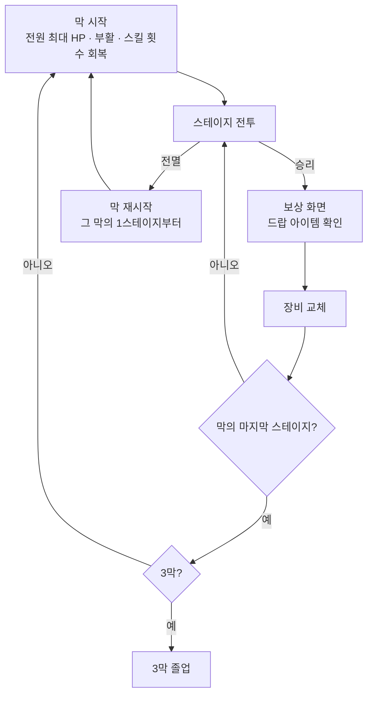

# 게임 구조 기획서

> M2에서 정한 게임 전체 구조입니다. 전투 밖의 진행, 막 단위 자원, 아이템, 격자 변경을 다룹니다.
>
> - 기준일: 2026-10-08 (2026-10-07 기획 논의 결정 반영)
> - 관련 문서: [기획 현황](DESIGN_STATUS.md) · [기획 로드맵](ROADMAP.md) · [전투 시스템 기획서](COMBAT_DESIGN.md)
> - 이 문서와 전투 시스템 기획서가 다르면 이 문서가 기준입니다. 바뀌는 전투 규칙은 [7장](#7-전투-시스템-기획서에서-바뀌는-규칙)에 모았습니다.
> - 표시: ✅ 정해짐 · ❓ 정해야 함

---

## 목차

1. [게임 목표](#1-게임-목표)
2. [진행 구조](#2-진행-구조)
3. [막 단위 자원](#3-막-단위-자원)
4. [아이템](#4-아이템)
5. [캐릭터](#5-캐릭터)
6. [헥사 격자](#6-헥사-격자)
7. [전투 시스템 기획서에서 바뀌는 규칙](#7-전투-시스템-기획서에서-바뀌는-규칙)
8. [정해야 할 것](#8-정해야-할-것)

---

## 1. 게임 목표

**캐릭터를 육성하면서 3막의 모든 스테이지를 깨는 것(3막 졸업)이 목표입니다.** ✅

- 육성 수단은 **아이템뿐**입니다. 레벨업, 능력치 성장, 재화는 두지 않습니다.
- 이야기와 세계관은 이 구조 위에 나중에 얹습니다 ([로드맵 M7](ROADMAP.md#10-m7-첫-플레이-가능-구간-기획)).

---

## 2. 진행 구조

### 2-1. 막과 스테이지 ✅

| 항목 | 결정 |
|---|---|
| 구성 | 3막 × 막당 3스테이지 = **전투 9번** |
| 순서 | 1-1 → 1-2 → 1-3 → 2-1 → … → 3-3. 스테이지를 고르지 않음 |
| 스테이지 하나 | 몬스터와 한 번 조우하는 맵 하나 |
| 스테이지 승리 | 몬스터를 **모두** 전투 불능으로 만듦 |
| 스테이지 패배 | 아군 **전원**이 전투 불능 |
| 레벨 디자인 | 9개 맵을 따로 디자인 ([로드맵 M5](ROADMAP.md#8-m5-콘텐츠-기획)) |

### 2-2. 흐름 ✅

- 전멸하면 **그 막의 1스테이지부터** 다시 합니다.
- 막을 다시 시작해도 **그 막에서 얻은 장비는 유지**합니다.
- 물약은 일회성 소모품입니다. 쓴 물약은 막을 다시 시작해도 돌아오지 않고, 얻은 물약은 남습니다 (3-1).

---

## 3. 막 단위 자원

### 3-1. 자원표 ✅

| 자원 | 같은 막의 스테이지 사이 | 막 시작 | 막 재시작 (전멸) |
|---|---|---|---|
| HP | **이어짐** (회복 없음) | 전원 최대 HP | 전원 최대 HP |
| 전투 불능 | **이어짐**. 남은 스테이지에 나오지 않음 | 부활 | 부활 |
| 스킬 사용 횟수 | **이어짐** | 회복 | 회복 |
| 장비 | 유지 | 유지 | 유지 |
| 물약 | 유지 | 유지 | 지금 가진 개수 그대로 |

- 스킬 사용 횟수의 **값은 지금 그대로**입니다(숨 고르기 1, 흘려내기 2 등). 단위만 전투당에서 막당으로 바뀝니다. 횟수 조정은 스킬 디자인 때 정합니다 (5장).
- 물약은 **몬스터 드랍으로만** 얻습니다. 시작할 때는 없습니다.

### 3-2. 막 안에서 전투 불능 ✅

전투 불능이 된 캐릭터는 그 막의 남은 스테이지에 나오지 않습니다. 남은 캐릭터만으로 싸우고, 다음 막 시작에 최대 HP로 부활합니다.

> 파티가 2명이라 1스테이지에서 한 명이 쓰러지면 남은 2스테이지를 혼자 싸웁니다. 난이도는 레벨 디자인과 밸런스(M5, M6)에서 확인합니다.

---

## 4. 아이템

### 4-1. 장비 ✅

| 항목 | 결정 |
|---|---|
| 장착 칸 | 캐릭터마다 **무기 1, 방어구 1** |
| 무작위 수치 | 드랍될 때 성능 수치가 무작위로 정해짐. 같은 아이템도 수치가 달라 다시 얻을 이유가 됨 |
| 교체 시점 | **스테이지 사이마다** (보상 화면 뒤) |
| 막 재시작 | 그 막에서 얻은 장비 유지 |

### 4-2. 드랍 ✅

| 항목 | 결정 |
|---|---|
| 보장 | 스테이지를 깨면 아이템 **1개 보장** |
| 추가 | 몬스터마다 확률로 추가 드랍 |
| 드랍 대상 | 장비(무기, 방어구)와 물약 |

보장 드랍이 있어 운이 나빠도 9전투에서 최소 9개를 얻습니다.

### 4-3. 아직 정하지 않은 것 ❓

수치는 기획 담당이 디자인합니다. 개발은 아래 값을 **데이터로 분리하고 임시값**을 넣습니다.

- 아이템 종류와 이름
- 장비가 올리는 수치와 무작위 범위 (예: 무기는 명중·피해, 방어구는 AC·최대 HP)
- 등급 유무
- 몬스터당 추가 드랍 확률, 보장 드랍이 장비인지 물약인지
- 막이 올라갈수록 수치가 좋아지는지
- 인벤토리 한도와 버리기

---

## 5. 캐릭터

| 항목 | 결정 |
|---|---|
| 파티 | 지금 그대로 전사 1, 궁수 1 ✅ |
| 역할 | **전사 = 탱커, 궁수 = 딜러** ✅ |
| 스킬 | 직업마다 스킬을 늘릴 수 있음. 스킬 디자인은 기획 담당이 정함 ❓ |

> 적 AI가 "사거리 안에서 HP가 낮은 대상"을 노리므로([전투 시스템 기획서 7장](COMBAT_DESIGN.md#7-적-ai)), 지금 규칙으로는 전사가 공격을 끌어 줄 수 없습니다. 탱커 스킬(도발 등)이나 적 AI 조준 규칙은 스킬 디자인과 함께 정합니다.

---

## 6. 헥사 격자

### 6-1. 결정 ✅

| 항목 | 결정 |
|---|---|
| 타일 | 육각형, **뾰족한 위(pointy-top)** |
| 맵 크기 | 지금 10×10과 비슷한 칸 수 |
| 인접 | 6칸 |
| 거리 | 헥사 거리. 이동력과 사거리는 헥사 칸 수로 셈 |
| 수치 | 이동력 6칸, 궁수 사거리 1~6칸 그대로 |

### 6-2. 개발 시안 뒤 확정 ❓

- 맵의 정확한 칸 수와 모양 (직사각형 배치 / 큰 육각형)
- 타일 픽셀 크기와 아이소 느낌 유지 여부. 기준 해상도 640×360과 정수 배율은 그대로 둡니다.
- 궁수 사거리 6이 맵 크기에 맞는지. 지금 사거리 6칸은 "맵에서 가장 먼 거리가 9칸"을 근거로 정했습니다.

---

## 7. 전투 시스템 기획서에서 바뀌는 규칙

[전투 시스템 기획서](COMBAT_DESIGN.md)의 아래 내용을 이 문서로 대체합니다. 나머지 규칙은 그대로입니다.

| 기획서 위치 | 지금 | 바뀜 |
|---|---|---|
| 2장 맵 | 10×10 아이소메트릭 격자 | 헥사 격자 (6장) |
| 2장 궁수 사거리 근거 | 10×10에서 가장 먼 거리 9칸 | 헥사 맵에서 다시 확인 (6-2) |
| 5-2 기회 공격 | 인접 칸(8칸)을 벗어날 때 | 인접 칸(**6칸**)을 벗어날 때 |
| 5-3 스킬 | 모든 스킬 횟수는 **전투당** | 모든 스킬 횟수는 **막당**. 값은 그대로 |
| 5-4 물약 | 유닛당 1개 | 몬스터 드랍으로 얻는 일회성 소모품. 시작 개수 0 |
| 5-4 밀치기 방향 | 밀치는 유닛 → 대상 방향(8방향) | 밀치는 유닛 → 대상 방향(**6방향**). 인접한 대상이라 방향이 항상 하나로 정해짐 |
| 9-3 동작 설명 | 전투당 남은 횟수 | 막당 남은 횟수 |
| 9-4 이동 미리보기 | 사각 격자 칸 | 헥사 칸. 표시 규칙은 그대로 |

"전투가 끝날 때까지" 유지되는 효과(표식 등)는 그대로 전투 단위입니다.

---

## 8. 정해야 할 것

| 항목 | 담당 | 언제 |
|---|---|---|
| 아이템 종류, 수치, 범위, 드랍 확률 (4-3) | 기획 | 드랍·장착 구현과 함께. 그 전까지 임시값 |
| 스킬 추가와 횟수, 탱커 수단 (5장) | 기획 | 스킬 디자인 |
| 헥사 맵 칸 수, 모양, 타일 크기 (6-2) | 개발 시안 → 기획 확인 | 헥사 격자 구현 |
| 몬스터 종류 | 기획 | M5. 그 전까지 지금의 적 전사·궁수를 씀 |
| 9개 스테이지 레벨 디자인 | 기획 | M5. 그 전까지 지금 시험 전투를 반복 |
| 저장 (게임을 껐다 켤 때) | 기획 | M7 |
