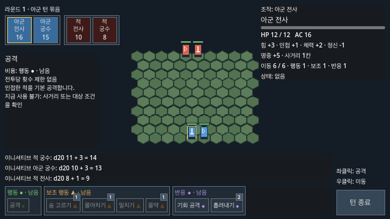
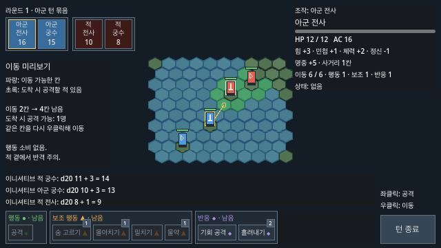

# Issue #53 헥사 격자 시안

기준: [Issue #53](https://github.com/minjunkim-dev/BGLike/issues/53), [게임 구조 기획서 6~7장](GAME_STRUCTURE.md#6-헥사-격자).
개발 기준 커밋: `6cfaaa0e24016964602f62b0cf07e48dc4290860`.

## 시안 값

| 항목 | 시안 |
|---|---|
| 맵 | 직사각형 배치, 10열 × 10행 = 100칸 |
| 타일 | 뾰족한 위(pointy-top), 20×20px |
| 좌표 | 홀수 행을 오른쪽으로 10px 이동. 행 간격 15px |
| 전체 타일 영역 | 210×155px |
| 거리 | 헥사 거리. 인접 6칸 |
| 수치 | 이동력 6, 궁수 사거리 1~6 유지 |
| 최대 거리 | 14칸. 예: `(0, 0)`에서 `(9, 9)` |
| 화면 | 640×360 기준, 정수 배율 유지 |

맵의 정확한 칸 수·모양·타일 크기는 **기획 확인 전 임시값**이다.
궁수 사거리 6의 적합성도 기획에서 확인해야 한다.
높이·장애물·지형 효과는 이번 범위에 없다.

Godot `TileSet`의 `HEXAGON / STACKED / HORIZONTAL`을 사용한다.
`HORIZONTAL`은 홀수 행을 가로로 이동하므로 타일 위가 뾰족하다.
설정 의미는 [Godot TileSet 문서](https://docs.godotengine.org/en/stable/classes/class_tileset.html)와 Godot 4.7.2의 실제 좌표·이웃 출력으로 확인했다.

## 화면

Godot 4.7.2에서 실제 장면을 렌더링했다.
자동 캡처에는 턴 순서를 고정했다.
화면 캡처는 사람이 수행한 조작 검증을 대신하지 않는다.

기본 배치:

이동 미리보기:

두 번째 화면에서는 미리보기 표시를 확인하려고 유닛 위치를 임시로 옮겼다.
기본 장면의 배치는 바꾸지 않았다.
파랑은 이동 가능한 칸이다.
초록은 도착 후 기본 공격할 적이 있는 칸이다.
경로·남은 이동력·공격 가능한 적의 테두리를 표시한다.

## 검증

- Godot 타일의 100칸에서 중심 좌표 왕복과 6칸 이웃을 검사했다.
- 두 행의 6방향에서 이동 비용·근접 공격·원거리 불리·밀치기·기회 공격을 검사했다.
- 점유·맵 밖 밀치기와 헥사 거리 6/7의 이동·공격 경계를 검사했다.
- 기존 입력·이동 미리보기·반응·적 AI·전투 종료 테스트를 헥사 기준으로 갱신했다.

## 사람이 확인할 항목

1. 편집기에서 메인 장면을 실행한다. 타일과 유닛의 크기·구분·겹침을 확인한다.
2. 빈 칸을 우클릭한다. 경로와 파랑·초록 표시를 확인한다. 같은 칸을 다시 우클릭해 이동한다.
3. 이동 후 적을 두 번 좌클릭한다. 공격과 사거리 안내를 확인한다.
4. 밀치기와 인접을 벗어나는 이동을 실행한다. 밀려날 방향과 반응 창을 확인한다.
5. 적 턴을 진행한다. 접근·후퇴를 확인한다. 맵 모양·100칸·20×20px·궁수 사거리 6의 기획 확인 결과를 Issue #53에 기록한다.

위 조작 검증과 기획 확인은 아직 완료하지 않았다.
