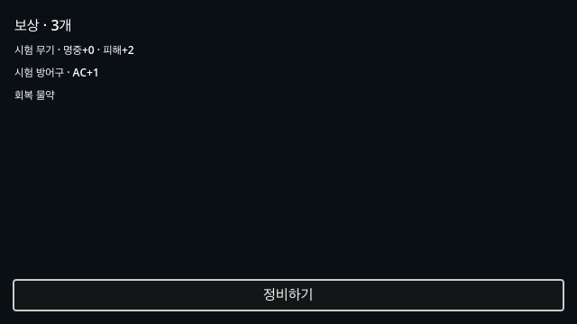
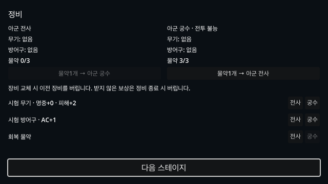
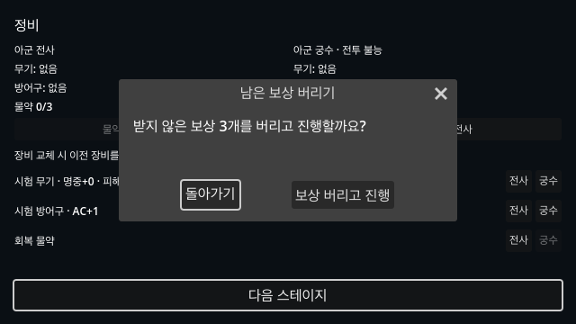

# Issue #55 드랍·장착과 정비

기준은 [Issue #55](https://github.com/minjunkim-dev/BGLike/issues/55)와 [게임 구조 기획서4장](GAME_STRUCTURE.md#4-아이템)이다.
기획자 코멘트3개에서 물약 분배·물약 한도·전투 불능 캐릭터 수령을 확정했다.
전투 화면 UI/UX 개선 Issue #58은 이번 범위 밖이다.

## 흐름

승리 → 보상 확인 → 정비 → 다음 스테이지 또는 다음 막으로 간다.
3-3도 보상과 정비를 마친 뒤 졸업한다.
패배하면 보상 없이 현재 막의 첫 전투로 돌아간다.
몬스터 드랍을 승리 시 한 번만 모은다.
승리마다 보장1개와 몬스터별 추가 드랍을 합산한다.

정비에서 각 보상의 `전사`·`궁수` 버튼을 눌러 나눠 준다.
장비는 해당 캐릭터의 무기·방어구 칸에 바로 장착한다.
교체한 이전 장비는 버린다.
받지 않은 보상은 정비 종료 시 버린다.
남은 보상이 있으면 폐기를 확인한다. 확인 창의 기본 선택은 `돌아가기`다.
연속 클릭으로 정비를 끝내도 확인 전에는 보상을 버리지 않는다.
전체 인벤토리를 미리 구현하지 않는다.
장비는 독립된 아이템 Dictionary로 보관하므로 이후 보관 방식을 바꿀 수 있다.

물약은 캐릭터마다 보유한다.
정비의 양도 버튼은 물약1개를 다른 캐릭터에게 넘긴다.
한도에 도달하면 추가 수령과 양도 버튼을 끈다.
전투 불능 캐릭터도 아이템을 받고 물약을 넘긴다.
아이템 수령이 캐릭터를 부활시키거나 HP를 회복하지 않는다.
막 시작·재시작은 장비와 현재 물약 개수를 유지한다.
전투에서 물약은 기존 보조 행동과2d4+2 회복 규칙을 쓴다.

## 한 파일에서 바꾸는 임시 데이터

`scenes/combat/item_data.json`은 사람이 편집하는 JSON이다.
주석과 마지막 쉼표는 쓰지 않는다.
기획 수치가 확정되기 전까지 아래 값을 사용한다.

| 항목 | 임시값 |
|---|---|
| 종류와 이름 | 시험 무기, 시험 방어구, 회복 물약 |
| 무기 효과 | 기본 명중에+0~2, 기본 피해에+1~3 |
| 방어구 효과 | 기본AC에+1~3 |
| 물약 수령 | 보상1개당 물약1개 |
| 추첨 비중 | 세 종류 각각1. 보장·추가 모두 같은 풀 사용 |
| 몬스터당 추가 확률 | 0.35(35%) |
| 물약 보유 한도 | 캐릭터당3개. 기획 확정값 |
| 등급·막별 상승 | 없음. 미정 사항의 임시 처리 |

장비 최대HP 효과는 현재 임시 데이터에서 쓰지 않는다.
지원 수치는 `attack_bonus`·`damage_bonus`·`armor_class`다.
장비가 올리는 값은 능력치 자체를 바꾸지 않는다.
명중 미리보기, 일반 공격·기회 공격·충격 화살과 대상AC가 같은 장비 수치를 사용한다.
고정 피해 보정은 치명타에서도 한 번만 더한다.

1. `items`에 아이템 종류를 넣는다. `id`는 식별자, `name`은 표시 이름이다.
2. `kind`를 `weapon`, `armor`, `potion` 중 하나로 넣는다.
3. `weight`에 양의 정수 추첨 비중을 넣는다. `stats`의 수치는 `[최소, 최대]` 정수 범위다. 물약의 `stats`는 비운다.
4. `extra_drop_chance`에0~1 확률을 넣는다. `potion_limit`에 양의 정수 한도를 넣는다.
5. 메인 장면을 다시 실행한다. 변경한 값은 새 실행에서 읽는다.

모든 캐릭터가 두 장비 칸을 사용한다.
직업 제한, 등급과 막별 수치 상승은 기획이 정하면 별도로 추가한다.
저장과 플랫폼 내보내기는 이번 범위 밖이다.
플랫폼 내보내기 구현 시 비리소스 파일인 `item_data.json`을 내보내기 포함 필터에 넣어야 한다.

## 검증 경계

`GODOT=/Applications/Godot.app/Contents/MacOS/Godot make check`는 기존 전투 회귀 검사와 새 `combat_loot_test.gd`를 실행한다.
2026-10-08 로컬 전체 검사에서 Python51개와 Godot3939개 검사를 통과했다.
Godot 확인 수는 turns2366·checks61·actions267·HUD1085·AI67·progression48·loot45다.
드랍 검사에는 고정seed와 추가 확률0·1을 사용한다.
검사 전용 데이터로 범위와 세 종류, 독립 수치, 장비 교체, 한도와 양도, 전투 불능 수령을 검사한다.
기획의 실제 임시값을 바꿔도 검사 입력은 유지한다.
실제 공격·명중 미리보기·보조 행동 물약 소비를 검사한다.
실제 메인 장면에서 포인터 입력으로 보상 확인·정비·분배·양도·다음 전투·막 재시작을 검사한다.
연속 클릭의 즉시 폐기 방지와 확인 창 기본 포커스를 검사한다.
확인 창의 Enter 입력으로 폐기 취소와 명시적 폐기를 검사한다.
기존 진행 검사와 일부 상태 구성은 폐기 확인 신호를 직접 보낸다.
분배·양도 뒤 키보드 포커스 유지도 검사한다.
승리 조건과 일부 보상·HP는 테스트 값으로 설정한다.
기존 진행 검사는9전투 순서와 최종 정비 후 졸업을 검사한다.
자동 입력과 렌더링은 사람의 직접 플레이·조작감·기획 검수가 아니다.

## 실제 렌더링 화면

Godot4.7.2의 실제 장면을640×360에서 렌더링했다.
캡처는 승리와 궁수 전투 불능·물약3개를 테스트 값으로 설정했다.
세 종류를 함께 보여 주려고 추가 확률1로 굴린 고정seed 보상이다.
실제 기본 확률은35%다.

보상 확인:

정비와 전투 불능 캐릭터 분배·양도:

미수령 보상 폐기 확인:

## 사람이 확인할 항목

1. 메인 장면에서 승리한다. `보상 확인`을 누른다. 얻은 아이템과 무작위 수치를 읽는다.
2. `정비하기`를 누른다. 장비를 나눠 주고 같은 칸의 장비를 다시 바꾼다. 이전 장비가 사라지는지 확인한다.
3. 물약을 캐릭터에게3개까지 준다. 전투 불능 캐릭터에게도 주고 양도한다. 한도 이상 받거나 넘길 수 없는지 확인한다.
4. 받지 않은 보상을 남기고 다음 전투로 간다. 장비 판정·물약 소비를 확인한다. 전멸 뒤 장비와 남은 물약만 유지하는지 확인한다.
5. 3-3을 승리한다. 보상·정비를 마친 뒤 졸업하는지 확인한다. 기준 화면과 정수 배율에서 긴 목록을 스크롤해 확인한다.
