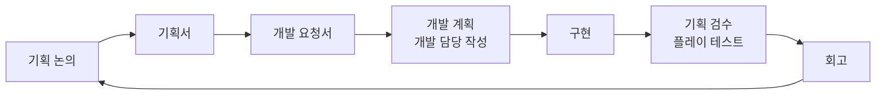
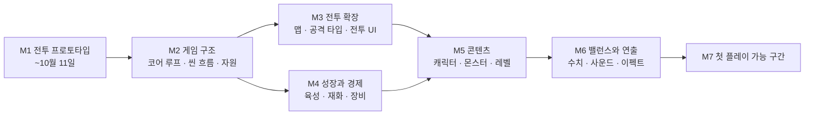
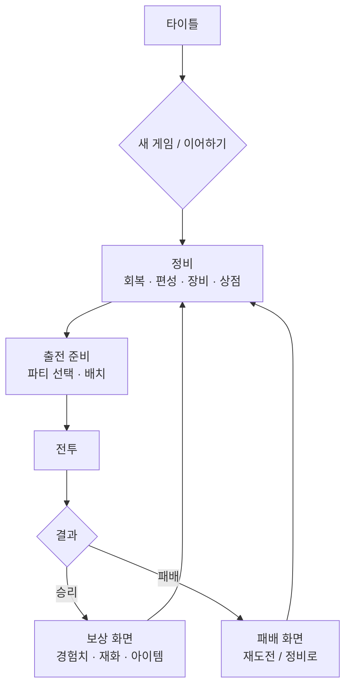

# 기획 로드맵

> 무엇을 어떤 순서로 기획할지 정리한 문서입니다. 개발 일정은 다루지 않습니다.
> 각 단계의 기획 결과는 **개발 요청서**로 개발 담당에게 넘기고, 개발 담당이 그 문서를 보고 개발 계획을 씁니다.
>
> - 기준일: 2026-10-02
> - 관련 문서: [기획 현황](DESIGN_STATUS.md) · [전투 시스템 기획서](COMBAT_DESIGN.md) · [M1 개발 요청서](DEV_REQUEST_M1.md)
> - 표시: ✅ 정해짐 · 🟡 제안(합의 전) · ❓ 정해야 함

---

## 목차

1. [기획과 개발의 연결](#1-기획과-개발의-연결)
2. [전체 흐름](#2-전체-흐름)
3. [기획 영역 지도](#3-기획-영역-지도)
4. [M1 전투 프로토타입 기획](#4-m1-전투-프로토타입-기획-10월-2일--10월-11일)
5. [M2 게임 구조 기획](#5-m2-게임-구조-기획)
6. [M3 전투 확장 기획](#6-m3-전투-확장-기획)
7. [M4 성장과 경제 기획](#7-m4-성장과-경제-기획)
8. [M5 콘텐츠 기획](#8-m5-콘텐츠-기획)
9. [M6 밸런스와 연출 기획](#9-m6-밸런스와-연출-기획)
10. [M7 첫 플레이 가능 구간 기획](#10-m7-첫-플레이-가능-구간-기획)
11. [기획 문서 목록](#11-기획-문서-목록)
12. [더 고민할 것](#12-더-고민할-것)

---

## 1. 기획과 개발의 연결

| 단계 | 담당 | 내용 |
|---|---|---|
| 기획서 | 기획 | 규칙과 수치. "무엇을" 만드는가 |
| 개발 요청서 | 기획 | 이번 단계의 목표, 범위, 우선순위, 검수 기준 |
| 개발 계획 | 개발 | 작업 분할, 순서, 일정. "어떻게, 언제" 만드는가 |
| 기획 검수 | 기획 | 개발 요청서의 검수 기준대로 직접 플레이해 확인 |
| 회고 | 함께 | 유지할 것, 바꿀 것. 다음 단계 기획의 입력 |

---

## 2. 전체 흐름

| 마일스톤 | 기획 목표 | 기획 결과물 | 상태 |
|---|---|---|---|
| **M1 전투 프로토타입** | BG3 전투를 구현해 프로젝트의 느낌을 확인 | 전투 시스템 기획서, 개발 요청서, 프로토타입 회고 | ✅ 범위 확정 |
| **M2 게임 구조** | 무엇을 반복하는 게임인지 정함 | 게임 비전, 코어 루프, 씬 흐름, 자원 기획서 | 🟡 |
| **M3 전투 확장** | 전투의 깊이와 전투 화면 | 맵, 공격 타입, 전투 UI 기획서 | 🟡 |
| **M4 성장과 경제** | 전투 사이에 강해지는 구조 | 성장·경제 기획서 | 🟡 |
| **M5 콘텐츠** | 실제로 만들 것의 목록 | 캐릭터, 몬스터, 레벨 디자인 문서 | 🟡 |
| **M6 밸런스와 연출** | 수치와 손맛 | 밸런스 표, 사운드·이펙트 목록 | 🟡 |
| **M7 첫 플레이 가능 구간** | 처음부터 끝까지 하는 짧은 구간 | 구간 기획서 | 🟡 |

- 각 마일스톤 끝에 그 단계의 개발 요청서를 씁니다.
- M3과 M4는 서로 기대지 않으므로 함께 기획할 수 있습니다.
- M2 이후 기간은 ❓입니다. M1 회고를 보고 정합니다.

---

## 3. 기획 영역 지도

| 분류 | 영역 | 마일스톤 |
|---|---|---|
| **게임 방향** | 게임 비전과 차별점, 출시 플랫폼 | M2 |
| **시스템 기획** | 코어 루프 | M2 |
| | 씬 구성과 씬 흐름도 (정비 시점, 보상 화면 포함) | M1 (전투 안 흐름), M2 (전체) |
| | 자원 시스템 | M2 |
| | 성장: 캐릭터 육성, 장비, 아이템 | M4 |
| | 성장 재화와 경제 | M4 (구조), M6 (밸런스) |
| **전투** | 전투 규칙 | M1 |
| | 공격 타입: 근거리/원거리, 대상/공간 조준, 직사/곡사, 속성 | M1 (근거리/원거리), M3 |
| | 주사위 종류, 대성공/대실패 | M1 (d20 치명타·자동 실패), M3 |
| **UI/UX** | 전투 화면 레이아웃, 주사위 결과 피드백 | M1 (기능 확인 수준), M3 (설계) |
| | 전투 외 화면 (정비, 보상, 메뉴) | M2 (흐름), M7 (완성) |
| **콘텐츠** | 맵 기획 | M3 |
| | 캐릭터 기획, 몬스터 기획, 레벨 디자인 | M5 |
| **연출** | 사운드, 이펙트 | M6 |
| **기타** | 이야기와 세계관, 아트, 저장과 난이도 | M7 |

---

## 4. M1 전투 프로토타입 기획 (10월 2일 ~ 10월 11일)

### 4-1. 목표

**BG3 전투 시스템을 그대로 구현해, 이 프로젝트가 어떤 느낌인지 확인합니다.**

- 확인하는 것: 턴 자원, 반응, 스킬, 판정이 만드는 전술 판단이 재미있는가
- 확인하지 않는 것: UI 완성도, 연출, 아트, 밸런스

### 4-2. 기획 작업

| 순서 | 작업 | 산출물 | 기한 | 상태 |
|---|---|---|---|---|
| 1 | 스프린트 범위 결정 | [기획 현황](DESIGN_STATUS.md) | 10월 2일 | ✅ |
| 2 | 전투 규칙 기획 | [전투 시스템 기획서](COMBAT_DESIGN.md) | 10월 2일 | ✅ |
| 3 | 개발 요청 | [M1 개발 요청서](DEV_REQUEST_M1.md) | 10월 3일 | 🟡 초안 |
| 4 | 개발 질문 응답, 기획서 갱신 | 기획서 수정 | 스프린트 중 | |
| 5 | M2 게임 구조 초안 시작 | 게임 비전 초안 | 스프린트 중 | |
| 6 | 기획 검수: 개발 요청서의 검수 기준대로 플레이 | 검수 결과 | 10월 11일 | |
| 7 | 프로토타입 회고 | 회고 문서 | 10월 11일 | |

### 4-3. 범위 우선순위

범위의 우선순위는 기획이 정합니다. 일정이 밀리면 아래 순서로 뺍니다.

| 순서 | 뺄 항목 | 영향 |
|---|---|---|
| 1 | 밀치기 | 공용 동작이 물약만 남음 |
| 2 | 물약 | 공용 동작 없음 |
| 3 | 턴 묶음 | 한 명씩 턴 진행 (프로토타입과 같음) |

턴 자원, 판정, 기회 공격, 스킬, 기절은 빼지 않습니다. BG3 전투의 핵심이기 때문입니다.

### 4-4. 완료 기준

- [ ] 개발 요청서를 개발 담당이 받고, 개발 계획이 나왔다.
- [ ] 기획 검수를 마쳤다.
- [ ] 프로토타입 회고를 썼다. 회고에는 다음을 적는다.
  - 재미있던 점, 지루하거나 어려웠던 점
  - BG3 규칙 중 더 뺄 것, 다시 넣을 것
  - M2 이후 기획에 넘길 질문 (예: 운 관리, 전투 템포)

---

## 5. M2 게임 구조 기획

**입력: M1 프로토타입 회고.** 뒤의 모든 기획이 이 결정을 전제로 하므로 순서대로 진행합니다.

| 순서 | 영역 | 정할 내용 | 산출물 |
|---|---|---|---|
| 1 | 게임 비전과 차별점 | 한 줄 소개, 핵심 재미 3가지, BG3와 다른 점, 범위와 목표 플레이 시간 | 게임 비전 |
| 2 | 출시 플랫폼 | PC / 모바일 / 둘 다 | 게임 비전 |
| 3 | **코어 루프** | 한 번의 반복에서 무엇을 하는가, 한 판의 길이 | 코어 루프 기획서 |
| 4 | **씬 구성과 흐름도** | 필요한 씬 목록, 씬 사이 이동, 정비 시점, 보상 화면 | 씬 흐름 기획서 |
| 5 | **자원 시스템** | 전투 사이에 무엇이 남고 무엇이 회복되는가 | 자원 기획서 |

### 씬 흐름 초안 🟡

코어 루프가 정해지기 전의 일반적인 형태입니다.

### 씬 흐름에서 정할 것 ❓

| 질문 | 선택지 예 | 연결되는 결정 |
|---|---|---|
| 정비는 언제 하나 | 매 전투 후 / 몇 전투 묶음 후 / 특정 지점에서만 | 자원 시스템, 난이도 |
| 보상 화면에 무엇이 나오나 | 경험치, 재화, 아이템, 선택형 보상 | 성장, 재화 |
| 전투 사이에 이동 화면이 있나 | 월드맵 / 노드 선택 / 없음 | 코어 루프 |
| 패배하면 어떻게 되나 | 재도전 / 마지막 저장으로 / 게임 오버 | 저장, 난이도 |
| 대화·이야기 장면은 어디에 끼나 | 전투 전후 / 정비 중 / 별도 씬 | 이야기 |

### 자원 시스템에서 정할 것 ❓

| 자원 | 질문 |
|---|---|
| HP | 전투가 끝나면 회복되나, 다음 전투로 이어지나 |
| 스킬 횟수 | 지금은 전투당. 정비 때 회복하는 방식으로 바꿀지 |
| 소모품 | 전투가 끝나도 남나, 어디서 얻나 |
| 재화 | 몇 종류인가 (예: 돈 1종 / 돈 + 성장 재료) |
| 시간·행동력 | 정비나 이동에 횟수 제한이 있나 |

> HP가 이어지면 정비가 회복 장소가 되어 "언제 정비하나"가 큰 판단이 됩니다. HP가 매번 회복되면 전투가 하나하나 독립된 퍼즐이 됩니다.

---

## 6. M3 전투 확장 기획

| 순서 | 영역 | 정할 내용 | 순서 이유 |
|---|---|---|---|
| 1 | 맵 기획 | 맵 크기, 장애물, 지형 요소, 높이 | 시야·엄폐와 직사/곡사의 전제 |
| 2 | 공격 타입 | 대상/공간 조준, 직사/곡사 | 장애물이 있어야 의미가 생김 |
| 3 | 공격 속성 | 물리/마법 2종 또는 다양한 속성, 저항·취약·면역 | M5 몬스터 기획과 함께 확정 |
| 4 | 주사위와 판정 확장 | 주사위 종류, 대성공/대실패 체계 | M1의 치명타·자동 실패를 확장 |
| 5 | 전투 UI 기획 | 레이아웃, 정보 표시, 주사위 결과 피드백 | 규칙이 늘어난 뒤 한 번에 설계 |

### 주사위 결과 피드백에서 정할 것 ❓

| 질문 | 선택지 예 |
|---|---|
| 굴림을 어디에 보여주나 | 로그만 / 화면 위 팝업 / 주사위 굴러가는 연출 |
| 수식을 얼마나 보여주나 | 결과만 ("명중") / 숫자 ("17 vs AC 16") / 전체 ("d20(12)+5=17 vs 16") |
| 유리/불리는 어떻게 보여주나 | 주사위 두 개를 나란히, 버려진 쪽은 흐리게 |
| 치명타·자동 실패 연출 | 색, 크기, 흔들림, 소리 |
| 연출이 턴 속도를 늦추면 | 빠르게 보기 / 건너뛰기 |

---

## 7. M4 성장과 경제 기획

| 순서 | 영역 | 정할 내용 |
|---|---|---|
| 1 | 캐릭터 육성 | 레벨업, 능력치 성장, 스킬 습득 |
| 2 | 장비 | 무기와 방어구. 무기가 공격 타입을 정하는지 |
| 3 | 아이템 | 소모품 종류, 획득 경로, 소지 한도 |
| 4 | 성장 재화 | 재화 종류, 얻는 곳, 쓰는 곳 (재화 흐름도) |

이 단계에서는 **구조**만 정합니다. 수치는 콘텐츠가 나온 뒤 M6에서 맞춥니다.

---

## 8. M5 콘텐츠 기획

| 순서 | 영역 | 정할 내용 |
|---|---|---|
| 1 | 캐릭터 기획 | 직업 수와 역할, 직업별 스킬, 파티 규모, 영구 사망 여부 |
| 2 | 몬스터 기획 | 종류, 역할(근접 / 원거리 / 지원), 고유 스킬과 AI, 속성 저항 |
| 3 | 레벨 디자인 | 전투별 맵·배치·목표(전멸 / 생존 / 탈출 / 호위), 난이도 곡선 |

---

## 9. M6 밸런스와 연출 기획

| 영역 | 정할 내용 |
|---|---|
| 성장 재화 밸런스 | 전투당 획득량, 성장 비용, 목표 플레이 시간에 맞춘 곡선 |
| 전투 밸런스 | 직업·몬스터 수치, 명중률과 피해 기대값 |
| 사운드 | 효과음 목록(공격, 명중, 빗나감, 치명타, 주사위), 배경음 분위기 |
| 이펙트 | 공격·스킬·상태 이상·주사위 연출 목록과 우선순위 |

---

## 10. M7 첫 플레이 가능 구간 기획

| 영역 | 정할 내용 |
|---|---|
| 구간 범위 | 전투 몇 번, 플레이 시간 몇 분 |
| 이야기와 세계관 | 배경, 주인공, 대화·선택지 비중, 게임 정식 이름 |
| 아트 | 에셋 출처, 카메라 확대·이동, 모바일 노치 영역 |
| 저장과 난이도 | 저장 방식, 난이도 옵션 |
| 전투 외 화면 | 타이틀, 정비, 보상, 메뉴, 설정 |

---

## 11. 기획 문서 목록

| 문서 | 마일스톤 | 상태 |
|---|---|---|
| [기획 현황](DESIGN_STATUS.md) | 공통 | ✅ |
| 기획 로드맵 (이 문서) | 공통 | ✅ |
| [전투 시스템 기획서](COMBAT_DESIGN.md) | M1 | ✅ |
| [M1 개발 요청서](DEV_REQUEST_M1.md) | M1 | 🟡 초안 |
| M1 프로토타입 회고 | M1 | ❓ 10월 11일 |
| 게임 비전, 코어 루프, 씬 흐름, 자원 기획서 | M2 | ❓ |
| 맵, 공격 타입, 전투 UI 기획서 | M3 | ❓ |
| 성장·경제 기획서 | M4 | ❓ |
| 캐릭터, 몬스터 기획서, 레벨 디자인 문서 | M5 | ❓ |
| 밸런스 표, 사운드·이펙트 목록 | M6 | ❓ |
| 첫 플레이 가능 구간 기획서 | M7 | ❓ |
| 각 마일스톤의 개발 요청서 | 각 단계 끝 | ❓ |

---

## 12. 더 고민할 것

로드맵에 아직 넣지 않은 주제입니다. 넣을지와 시기를 정해야 합니다.

| 주제 | 왜 필요한가 | 권하는 시기 |
|---|---|---|
| **범위와 목표 플레이 시간** | 두 사람이 만들 수 있는 양을 먼저 정해야 콘텐츠 수가 나옴 | M2 (게임 비전에 포함) |
| **운 관리** | d20 게임은 연속 빗나감이 큰 불만. 표시 확률 보정, 시드 고정, 다시 하기 허용 여부 | M1 회고 후 |
| **전투 템포** | 턴제는 연출이 쌓이면 느려짐. 빠르게 보기, 적 턴 가속 | M1 회고 후 |
| **튜토리얼** | 5e 규칙(유리/불리, 내성, 반응)은 처음 보는 사람에게 어려움 | M7 |
| **라이선스 표기** | SRD 5e(CC-BY-4.0)는 게임 안에 출처 표기가 필요. 폰트·무료 에셋 라이선스도 확인 | M7 이전 |
| **플레이 테스트 방법** | 무엇을 보고 재미를 판단할지 (승률, 전투 시간, 막힌 지점) | M1 회고 양식에 반영 |
| **언어** | 한국어만 / 다국어. 다국어면 텍스트를 처음부터 분리 | M2 |
| **출시 형태** | 스토어, 가격, 데모 공개 시점 | M7 이전 |
